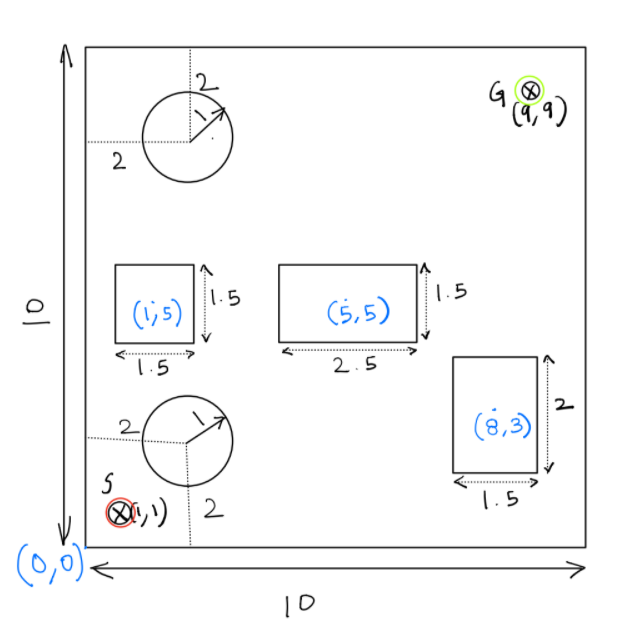
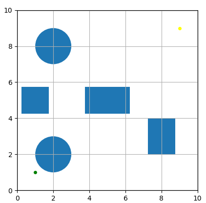
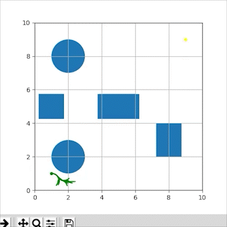

# A Star Path Planning on Turtlebot

Authors:

  

- Arunava Basu

- Aditi Ramadwar

  

This project utilizes the A Star algorithm to find the shortest optimal path between two points in a given map of obstacles.

The map is defined as follows :

  

  

  

  

  

## Steps to run the program

  

To run the program enter this command in a terminal :

  

roslaunch turtlebot_astar gazebo_.launch x_pos:=-4 y_pos:=-4

Gazebo maintains its origin at the center of the world where as the origin of our map in matplotlib is at the bottom left. Hence, the arguments provided for the launch file should match with the user input, such that pos = start - 5

For example:

For launch file  : x_pos = -4, y_pos = -4.5

For python user input after launching : start x = 1, start y = 0.5

  

> Enter choice :

> (1) Enter points manually

> (2) Default parameters

  

### Choice 1: Manual parameters

  

> Enter Clearence, eg = 0.3:

> Enter RPM1, eg = 2:

> Enter RPM2, eg = 3:

> Enter source points as X,Y,theta eg = 4, 0.5, 0 :

> Enter destination points as X,Y eg = 4, 8:

### Choice 2: Default parameters

- Start = (1, 1, 0)

- Goal = (9, 9, 0)

- Clearence = 0.3

- rpm1 = 2, rpm2 = 3

  

## [Gazebo Output Link](https://drive.google.com/file/d/1fTHATY70mAmW86jeslcLVCxxvLCsoOOm/view?usp=sharing)

  
  
  

The output image shows the path found.

  

- The explored vectors are shown in green during the search

- The optimal path is shown in red

- Yellow is the goal

- Blue is the start point

  
  

  

  

